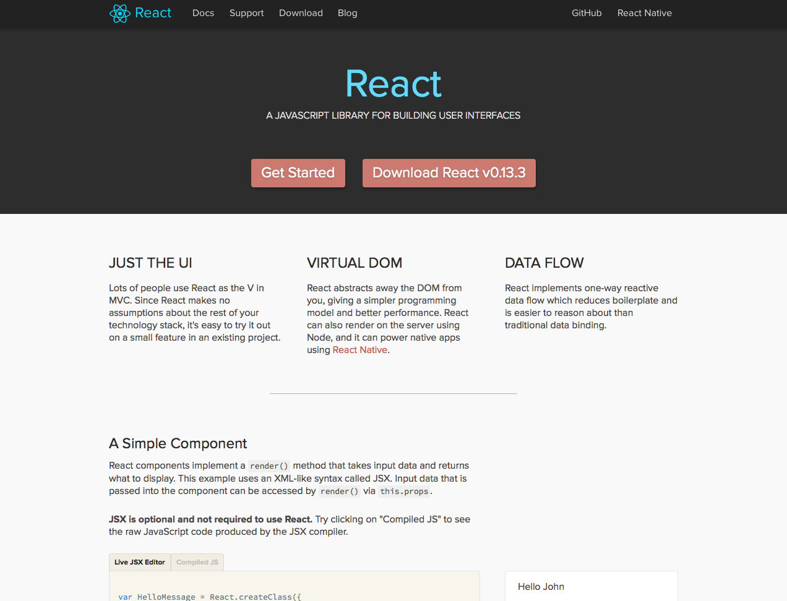

## React in 2 minutes

Note:
Who here as heard of React?
Who here has had a play?
Anyone using it in production?

---

<!-- .element: width="800" -->

Note:
React is A Javascript Library for building user interfaces. 

---

#### Components === Logic (JS) + Template (JSX)
<iframe height='600' scrolling='no' data-src='//codepen.io/vimto/embed/qdyJKO/?height=600&theme-id=17023&default-tab=js' frameborder='no' allowtransparency='true' allowfullscreen='true' style='width: 100%;'>See the Pen <a href='http://codepen.io/vimto/pen/qdyJKO/'>qdyJKO</a> by Vimal Jobanputra (<a href='http://codepen.io/vimto'>@vimto</a>) on <a href='http://codepen.io'>CodePen</a>.
</iframe>

Note:
The core building in React is a Component, which is somewhat analogous to Controllers and Views (Or Views + Templates if you're coming from Backbone) in MVC speak. 

Components are instantiated with properties, and store and manipulate state. They define a render method which generates HTML and other components using JSX. They also contain the logic for responding to events.

React is initialized by rendering a top level component into a HTML element. React manages the DOM from this point down, re-rendering with every change via it's Virtual DOM.

