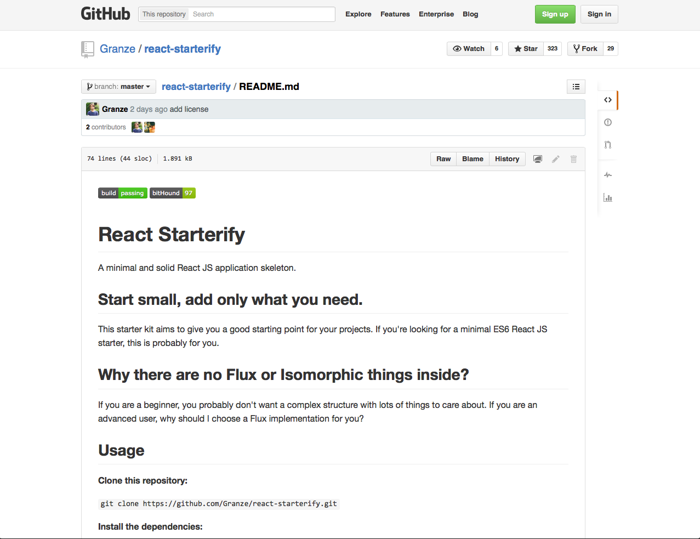
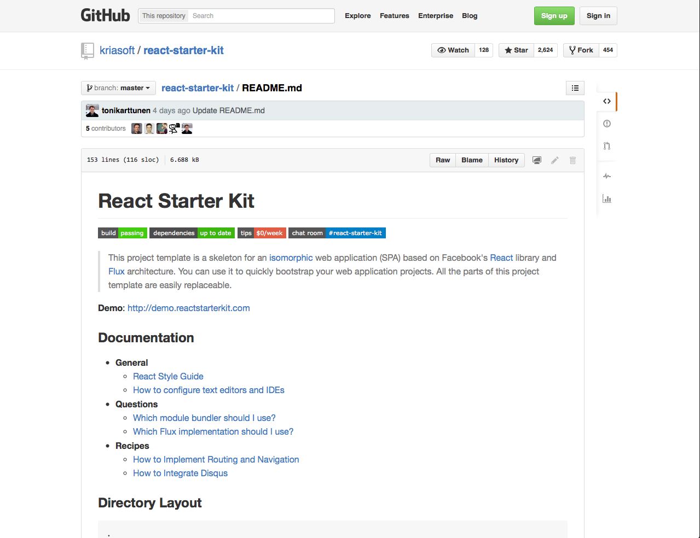
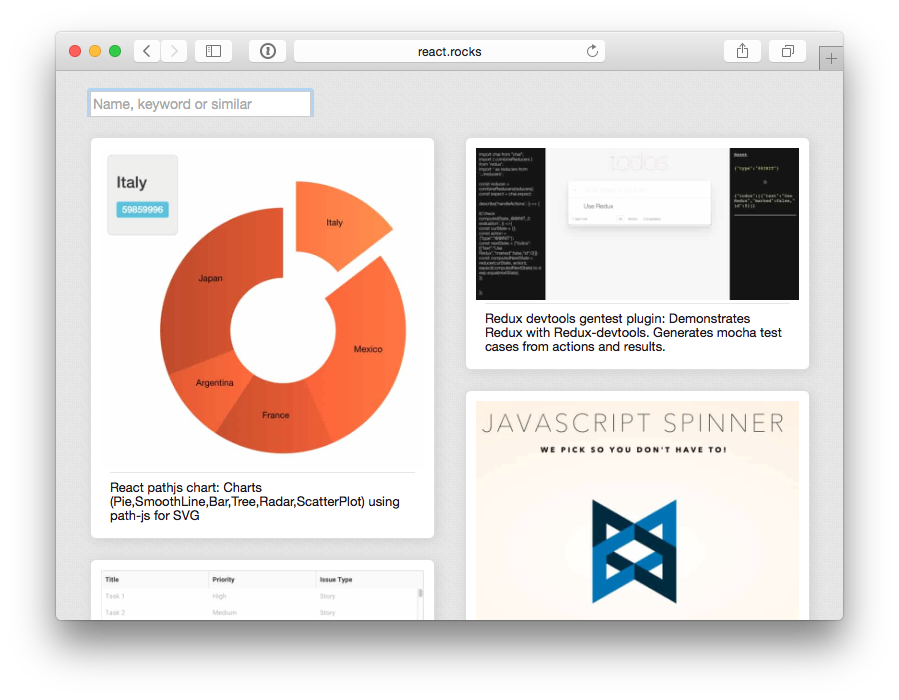
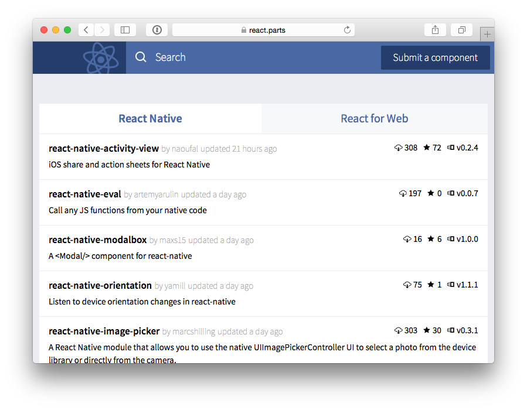
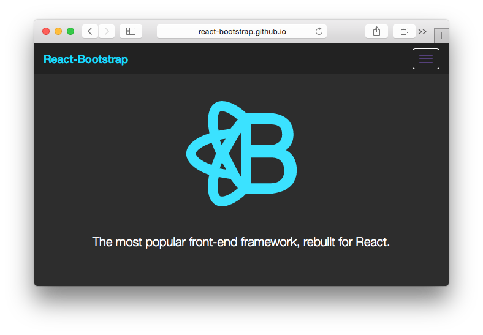
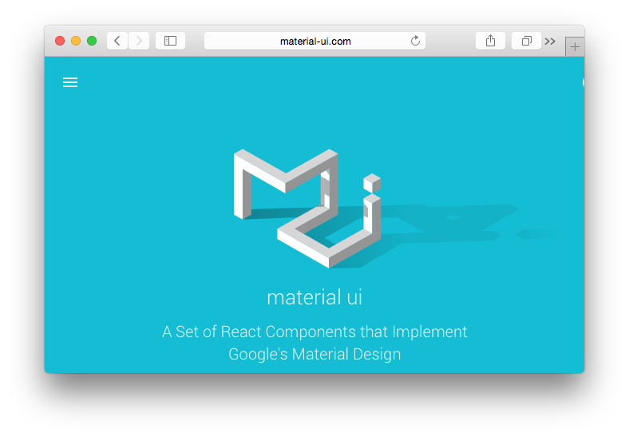
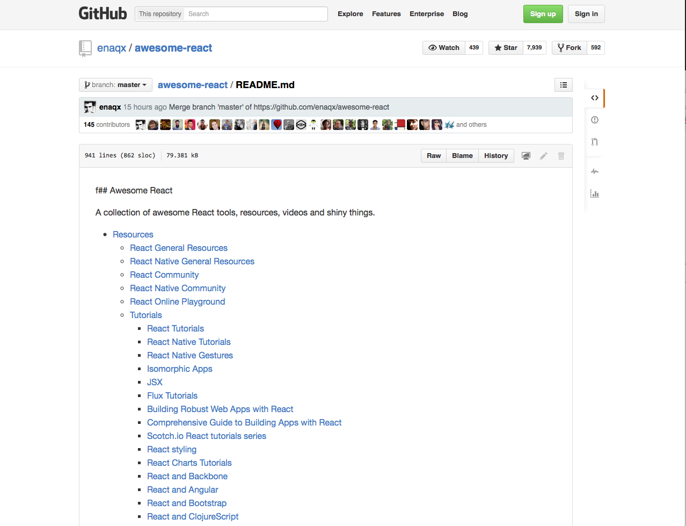

## Read the codes

---
 

### Project Templates
<!-- .element: width="450" style="float: left;"-->
<!-- .element: width="450" style="float: right;"-->

Note:
There are some good projects out there to help you get started, and check out examples of how other people have wired React into their front end build processes, and structured components.

react-starterify is a nice mimimal starting point if you're a fan of Browserify.

react-starter-kit is a more complete setup using Web Pack. I 

I genereally find them useful to jump in to and play aroundm, before starting again from scratch and using then as a reference to pick out the things I need.

 I genereally find them useful as examples, before starting from scratch and pulling in only what is needed.

At Atomic we have a toolchain based on Gulp and Browserify.

---

### Component libraries
    

<!-- .element: style="position: absolute; top: 100px; left: 100px; width: 400px; border: 0; box-shadow: none;"-->
<!-- .element: style="position: absolute; top: 100px; left: 500px; width: 400px; border: 0; box-shadow: none;"-->
<!-- .element: style="position: absolute; top: 400px; left: 100px; width: 400px; border: 0; box-shadow: none;"-->

<!-- .element: style="position: absolute; top: 400px; left: 500px; width: 400px; border: 0; box-shadow: none;"-->

      

Note:
There's a bunch of sample code out there in the form of component libraries. It can be really great to see what others have created.

- http://react.rocks
- https://react.parts
- http://react-bootstrap.github.io
- http://material-ui.com/#/

---

### READ ALL OF THE THINGS!
<!-- .element: width="700"-->

Note:
And if you really really want to read all of the things, there's a great big list on The Github called awesome-react.
