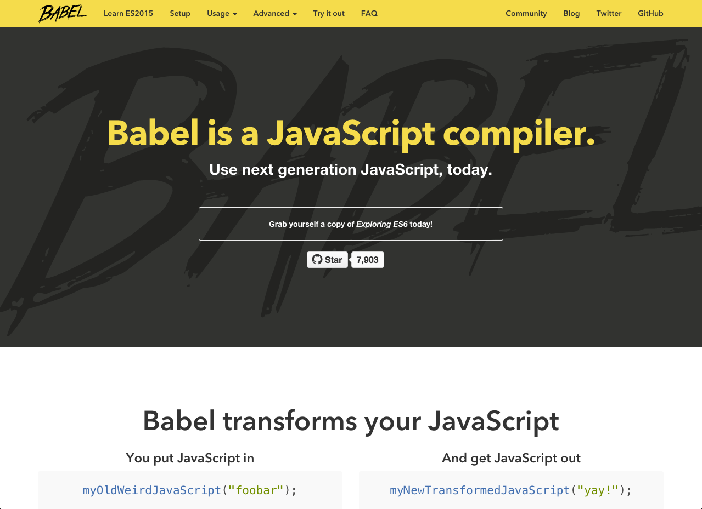

## Use ES6!
<!-- .element: width="700"-->

Note:
If you can :)
It's the future
- Check out Babel
- https://babeljs.io/repl

This isn't directly related to React, but the React team seem does to be very future-focussed, and are definitely developing the library with ES6 features in mind. Some examples of this include being able to define components as ES6 classes, (duck), to leaning on rest parameters to make composing components easier.

We started out a year and a half ago with CoffeeScript, which at the time offer a number of benefits over vanilla JavaScript, both in terms of syntax, and preventing you from shooting yourself in the foot.

In that time, the progress towards ES6 has been really impressive, with tools like Babel leading the way to make language features usable today. So we're in the proecss of transitioning our codebase to ES6 which feels really great.

---

<iframe width="1280px" style="max-width: 1280px; margin-left: -150px;" height="650px" src="https://babeljs.io/repl/#?experimental=true&evaluate=true&loose=false&spec=false&code=export%20class%20Counter%20extends%20React.Component%20%7B%0A%20%20constructor(props)%20%7B%0A%20%20%20%20super(props)%3B%0A%20%20%20%20this.state%20%3D%20%7Bcount%3A%20props.initialCount%7D%3B%0A%20%20%7D%0A%20%20tick()%20%7B%0A%20%20%20%20this.setState(%7Bcount%3A%20this.state.count%20%2B%201%7D)%3B%0A%20%20%7D%0A%20%20render()%20%7B%0A%20%20%20%20return%20(%0A%20%20%20%20%20%20%3Cdiv%20onClick%3D%7Bthis.tick.bind(this)%7D%3E%0A%20%20%20%20%20%20%20%20Clicks%3A%20%7Bthis.state.count%7D%0A%20%20%20%20%20%20%3C%2Fdiv%3E%0A%20%20%20%20)%3B%0A%20%20%7D%0A%7D%0ACounter.propTypes%20%3D%20%7B%20initialCount%3A%20React.PropTypes.number%20%7D%3B%0ACounter.defaultProps%20%3D%20%7B%20initialCount%3A%200%20%7D%3B" />  

