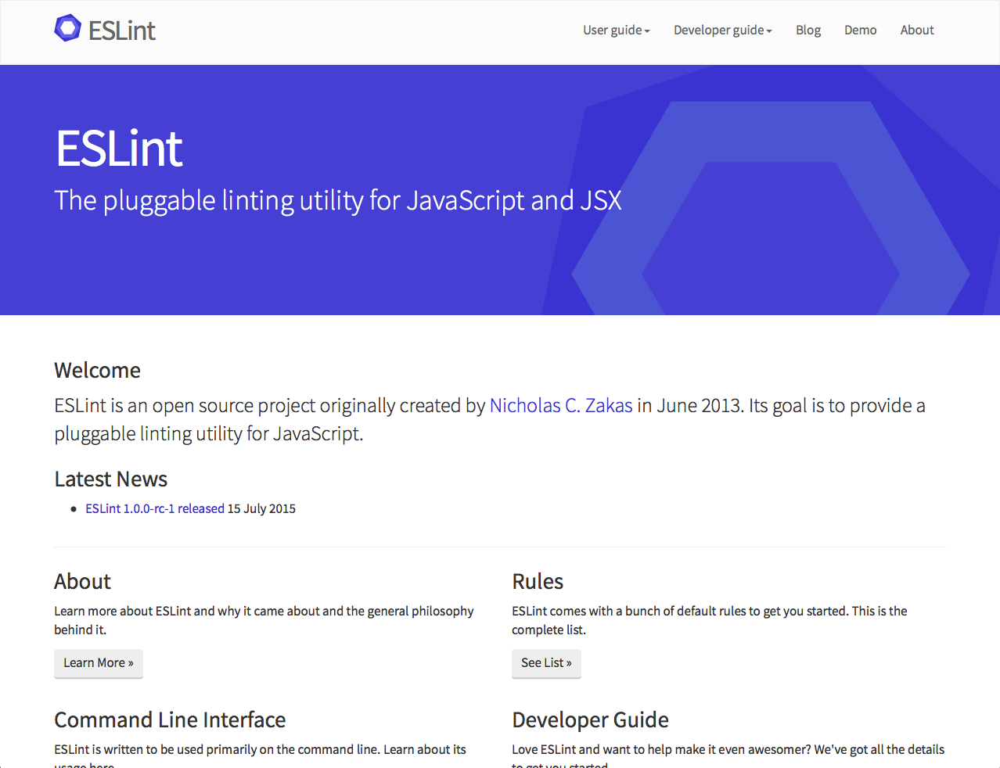
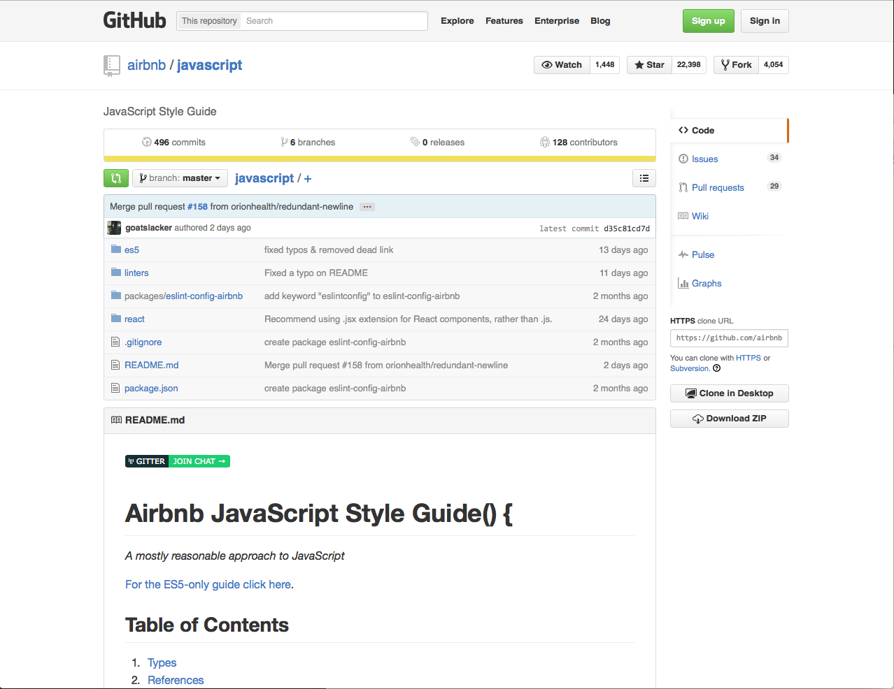
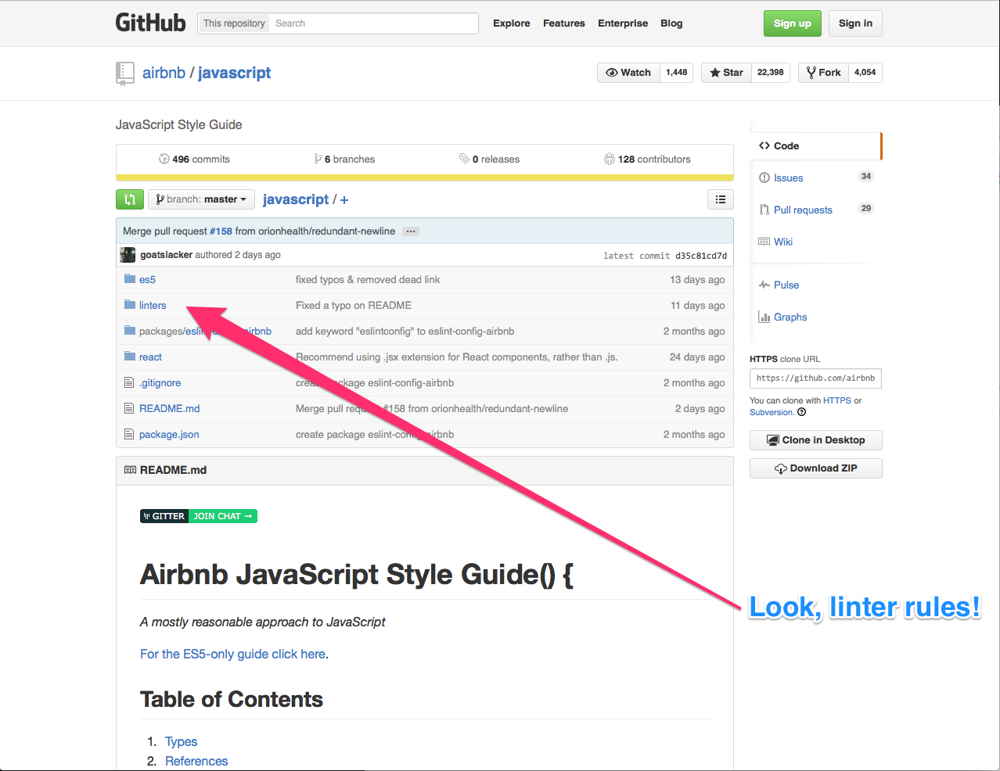
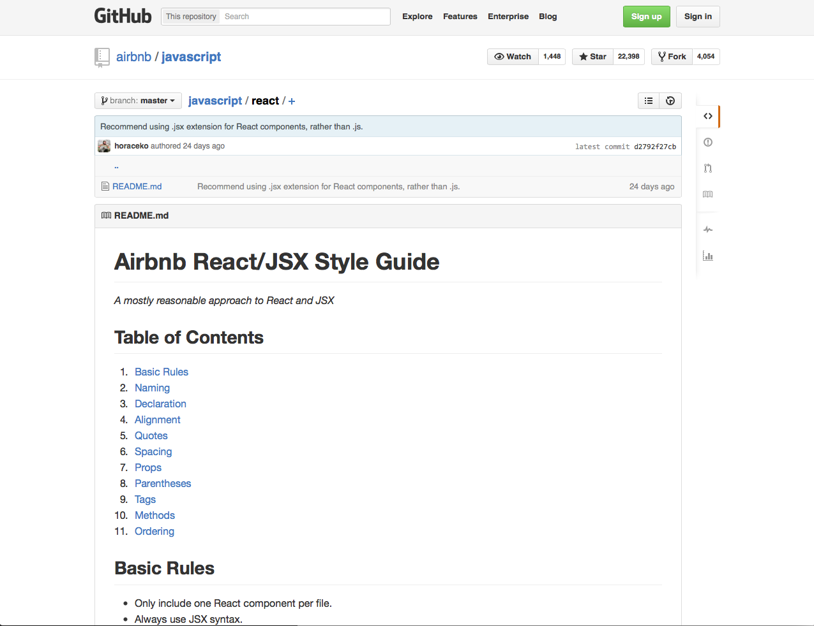
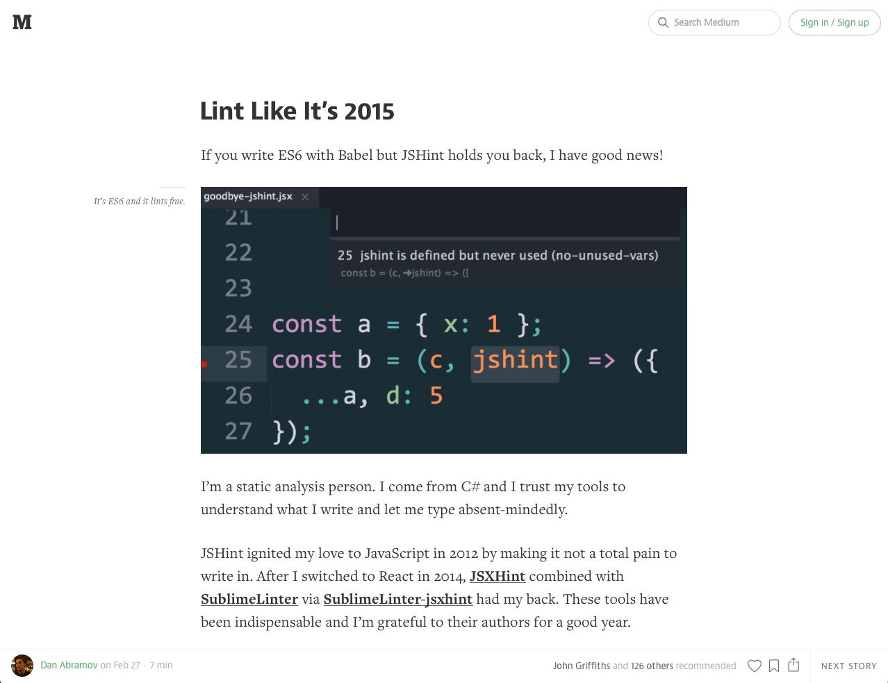

## Configure your editor
Bro.<!-- .element: class="fragment" -->

---

### ♡ ESLint ♡

<!-- .element: width="700"-->

Note:
Seems like an obvious thing to mention, but it's definitely worth taking the time to get set up properly.

We use ESLint which is great and extremely extensible.

---

### _A mostly reasonable approach to JS_

<!-- .element: width="700"-->

Note:
AirBNB have done a great job of defining a JavaScript styleguide, which we've adopted wholesale. 

---

### _A mostly reasonable approach to JS_

<!-- .element: width="700"-->

---

### With free React linting rules too!
<!-- .element: width="700"-->

Note:
This includes a supporting eslint configuration, and covers ES6 and React syntax, which is awesome.

---

###  It's a pain to set up
 
<!-- .element: width="700"-->

Note:
There are a few steps involved in getting this setup, and props to Dan Abramov for documenting how to get all of this set up in Sublime. Some of our team also use WebStorm and Atom, which I've heard great things about.

None use Vim.

---

<a href="subl://open?url=file:///Users/vim/code/sketches/wdcnz-2015-react-tips-and-tricks/code-samples/01.js">01 example of linting set-up.js</a>

