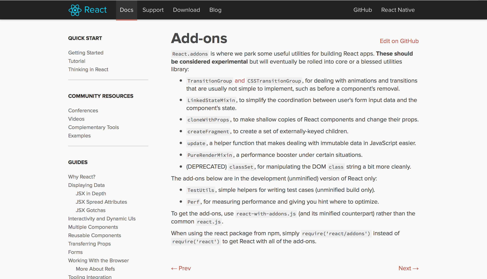
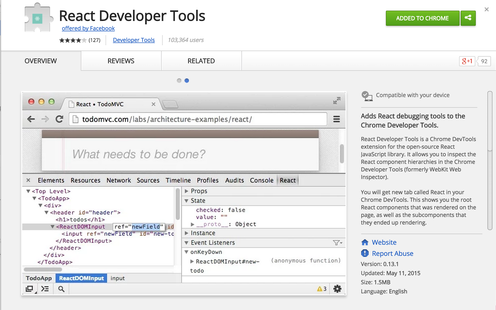

## Add-ons and browser plugins

---

Note:
In addition to the main library, React features a number of addins that are well worth checking out. I'll be covering a couple of them we use later on.

---

Note:
- There's a great Chrome Plugin which allows you to inspect your React component hierarchy including properties and state.

---

### React Hotloader

<iframe src="https://player.vimeo.com/video/100010922#t=7s?autoplay=0" width="1920" height="607" frameborder="0" webkitallowfullscreen mozallowfullscreen allowfullscreen></iframe>

Note:
I've also heard good things about the React Hot Loader, which allows you to live-edit components on a page whilst persisting the current state of the application.

---

### Check the console
<!-- .element: class="fragment" width="800" -->

