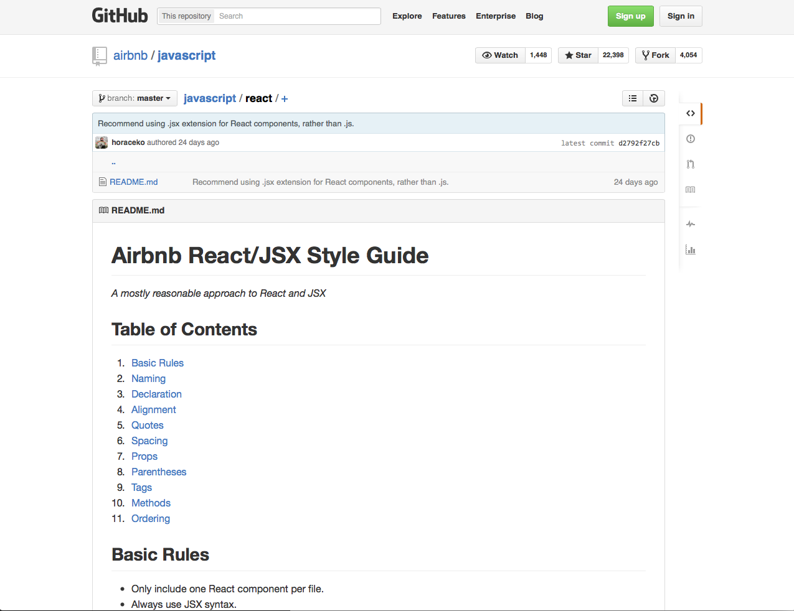

## Configure your editor

---

### ♡ ESLint ♡

<!-- .element: width="700"-->

Note:
Seems like an obvious thing to mention, but it's definitely worth taking the time to get set up properly.

We use ESLint which is great and extremely extensible.

---

### "_A mostly reasonable approach to JS_ "

<!-- .element: width="700"-->

Note:
AirBNB have done a great job of putting together a JavaScript styleguide, which we've adopted wholesale. 

---

### _A mostly reasonable approach to JS_

<!-- .element: width="700"-->

Note:
This also includes linter rules that you can plug straight into ESLint.

---

### React linting rules too
<!-- .element: width="700"-->

Note:
This includes a supporting eslint configuration, and covers ES6 and React syntax, which is awesome.

---

###  Can be a pain to set up
 
<a href="https://medium.com/@dan_abramov/lint-like-it-s-2015-6987d44c5b48"><!-- .element: width="700"--></a>

Note:
All of this can be a pain to set up.

But luckily, other people have been through that pain on your behalf, and written about it. 

This is a great guide by Dan Abramov on how to get everything set up in Sublime, if that's what you use.
