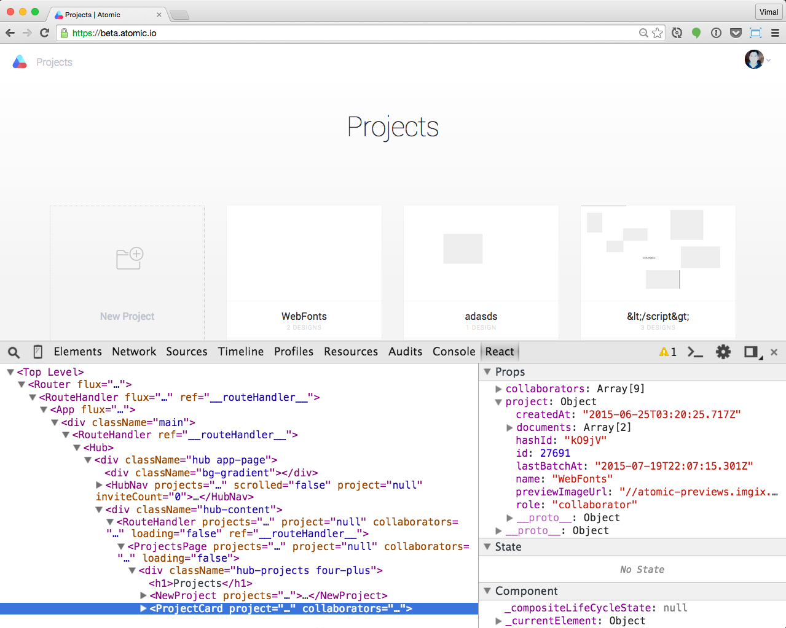

Note:
In addition to the main library, React features a bunch of really useful addons that are well worth checking out. 

I'll be covering some of these later on.

---

<!-- .element: width="800" -->

Note:
There's the React Developer Tools chrome extensions, which let's you see your component hierarchy in the Chrome inspector, and inspect state and props as it's running.

---

<!-- .element: width="800" -->

Note:
Which you can see installed and activated here on the Atomic App

---

### Check the console
<!-- .element: class="fragment" width="800" -->

Note:
And finally, remember to check the console.

React has a really developer friendly approach to letting you know about errors and warning in the console, so keep an eye out there.

