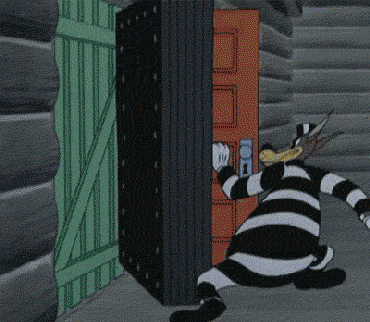

## Writing components

Note:
Right.
OK.

So you're all set and ready to write some components.

---

<!-- .element: width="600" -->

Note:
You've wired up you npm script to kick off your gulp task to browserify your ES6 whilst it's transformed using babel to convert your JSX to JavaScript?

So write some HTML to a web page?

Sweet.

