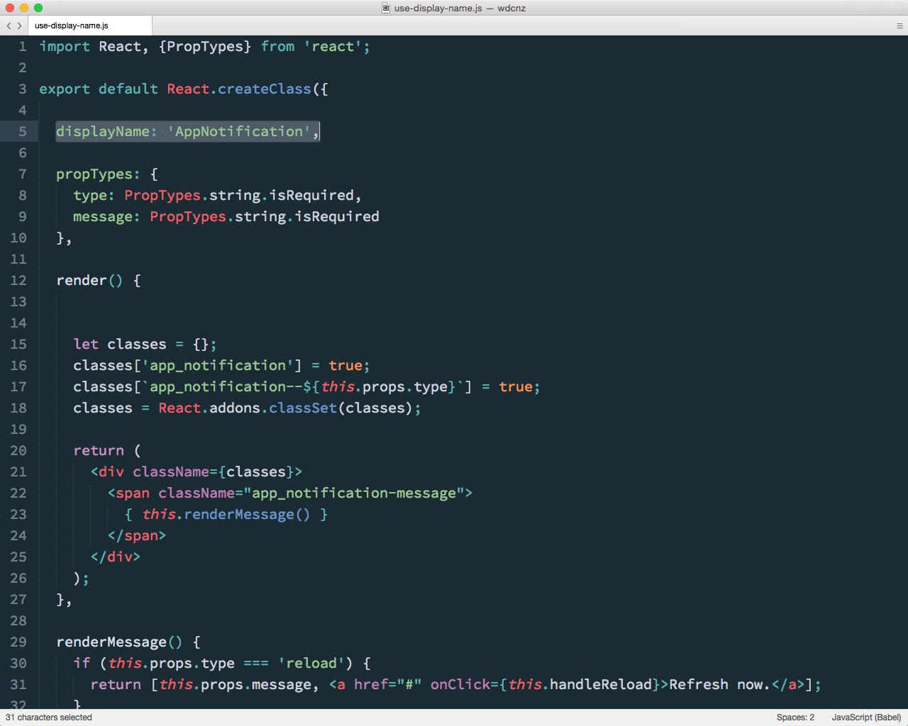
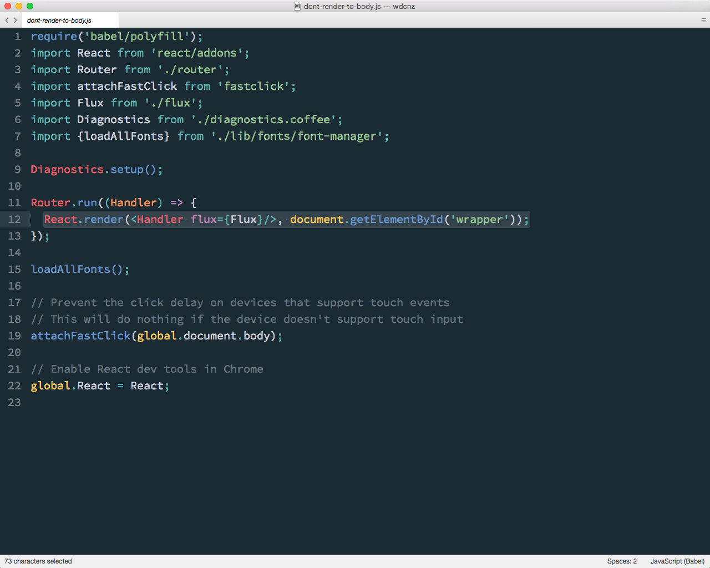
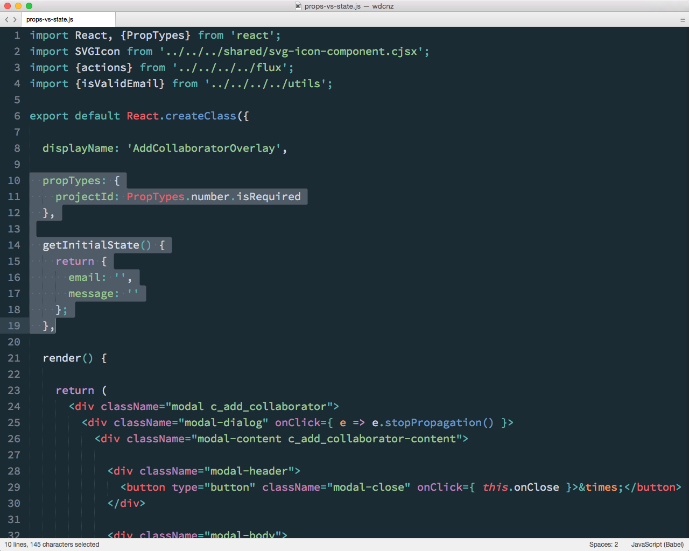

### Basics

Note:
So a few little things we learned as we started authoring components.

---

### JSX
<!-- .element: class="fragment" width="600" -->

Note:
There's definitely a bit of a reaction people have when they first see JSX.

Take a breath. It's OK. 

---

### It's just JavaScript.
<iframe width="1280px" style="max-width: 1280px; margin-left: -150px;" height="600px" data-src="https://facebook.github.io/react/jsx-compiler.html" />  

Note:
It takes a bit of getting used to, but it makes a lot of sense.

The first thing we tried to do was figure out a way to extract the templates back out to a separate files, which is definitely doable, but misses one of the main benefits of a component based approach - a seperation of concerns is NOT the same as a separation of technologies and having the display logic and generation co-located makes for a much nicer development flow.

---

### Use `displayName`

---

<!-- .element: width="800" -->

Note:
Use displayName. 

It's really helpfule when debugging. It's used in Chrome Inspector you saw before, and in the performance addon I'll show you in a bit.

 You get for free if you're defining components and assigning them to a named variable. 

---

### Don't Render to `body`

---

<!-- .element: width="800" -->

Note:
Don't render to body. 

This our bootstrap script that kicks the app off. 

We used to render to body, thinking in made sense for React to manage the whole page, since it was a single page app.

But we also use Googles WebFont loader which likes to add lot's of classes to the body tag, so this didn't go so well.

---

### Props vs State

Note:
A common source of confusion for us initially was the diference between props and state.

This was something that tripped us up a bit when we first started writing components.

---

Note:
It's useful to think of props as context — passed into a component, and immutable by that component.

If a component needs to persist some local data as part if it's life, we can store this as mutable state in the component. 

Here you can see that the projectId passed into the Add CollaboratorOverlay is a property - it's owned by the parent, and won't be changed by the Collaborator component.

But this component _will_ show a form with an email and message field, so it needs some state to track the values if these fields.
