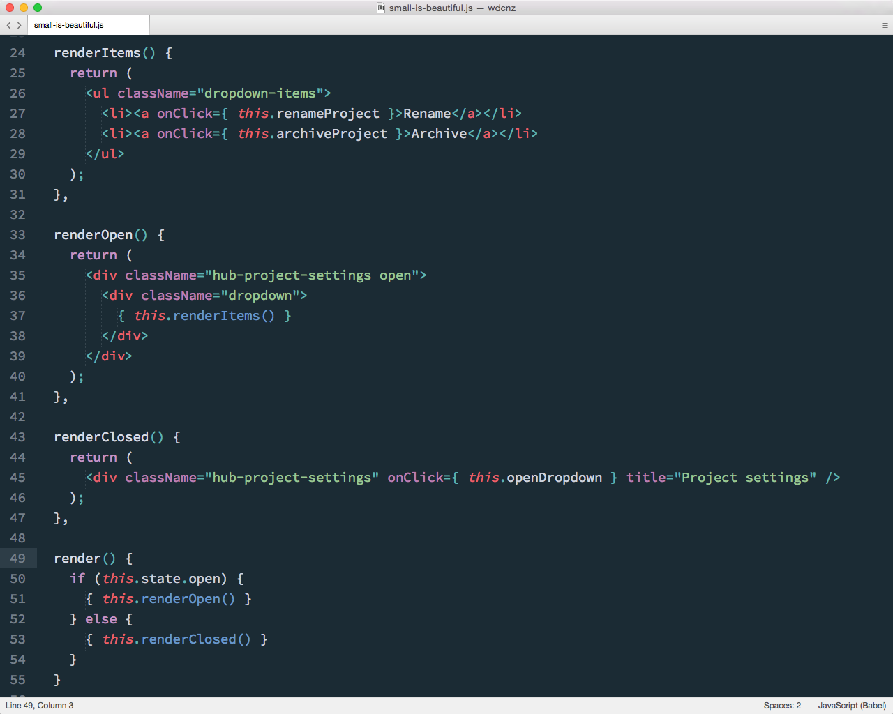

### Small is beautiful

---

Note:
One aspect of this I particularly like is the ability to define small pieces of ui as functions. 

Since JSX can be returned by any function, and not just render, there is very little friction to decomposing further inside components, if it doesn't make sense to extract fully extract to sub-component.

You start to think of chunks of UI as simple functions, which are unit-testable just like any other code.

