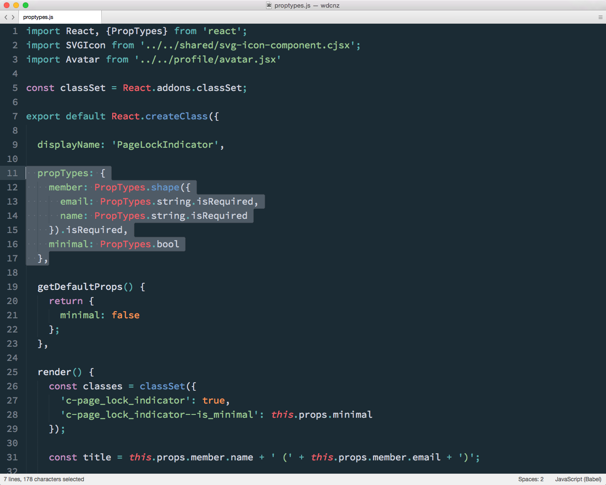

## Reuse

Note:
Since components are intended to be self-conatained and discrete, they naturally pull you towards reuse.

---

## `propTypes`

---

Note:
To help with this, React let's you define a schema to validate the props that are passed to a component using propTypes, and set some default values. If create a component with the wrong type of props, a warning is logged to console.

Initially these seemed redundant, since we weren't interested in a type system.

But as our app as grown, we've started to find them useful, both in terms of helping think about a data contract upfront, and catching type issues early.

---

## Mixins

---

Note:
Something else that helps with re-use is mixins.

These mixins are simple modules that can access a components state, and hook into a components lifecycle, that are useful for capturing cross-cutting concerns. 

Here we see one that set's a components state in response to change events from a Store.

---

Note:
These mixins are then simply referenced in the definition of the component that needs to access them.

These _seem_ to be falling out of favour with the React team, as it tries to remove some internal magic from the library in favour of native ES6 constructs. 

We're still using them, but we're considering alternative approaches before creating new ones.

---

## Higher order components

---

Note:
An alternate approach that we've come across and started to experiment with is higher order components.

A higher-order component is a function that takes an existing component and returns another component that wraps it. 

The functional equivelant of currying.

It looks a lot like the mixin, but instead of accessing the components internal state directly, it wraps it and passed additional properties to it.

---

Note:
And here's how it's applied to a components.

It's elegant, and reminds me very much of the decorator pattern. It does have a couple of trade-offs — wrapping components with multiple concerns becomes difficult, and these higher order components can't (by default) don't have access to a components state, and so require you to add a property layer.

---

### Inheritence

---

Note:

Finally, since Components can be declared as Classes, there's always good old fasioned inheritence. We don't really use inheritence. Does anyone any more?
