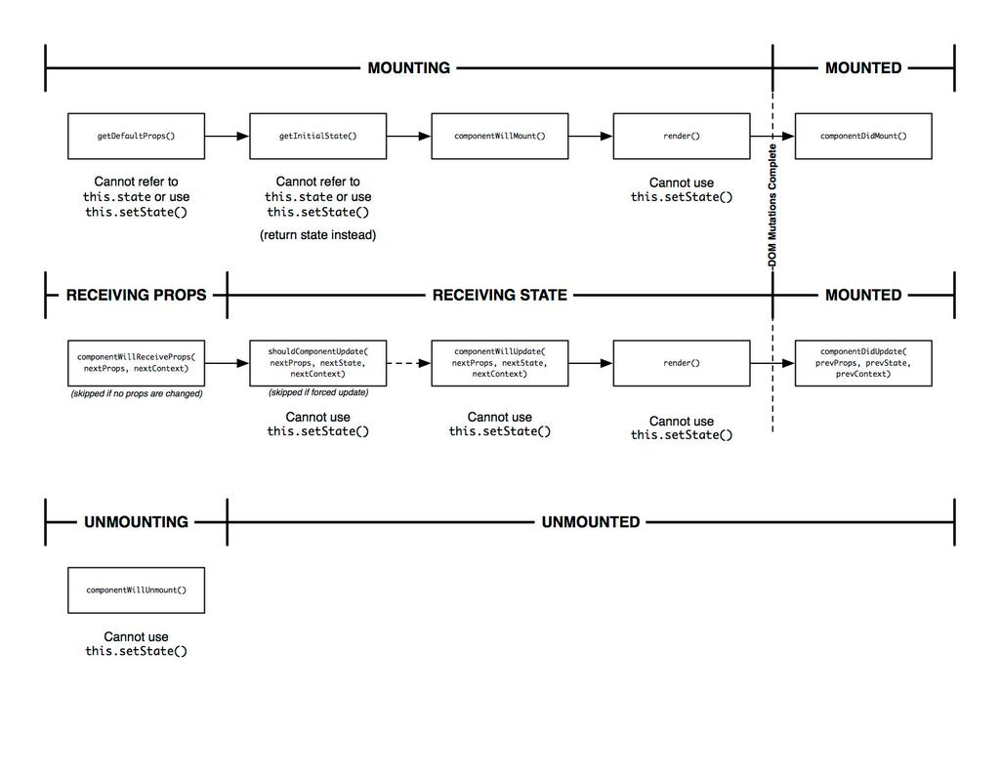
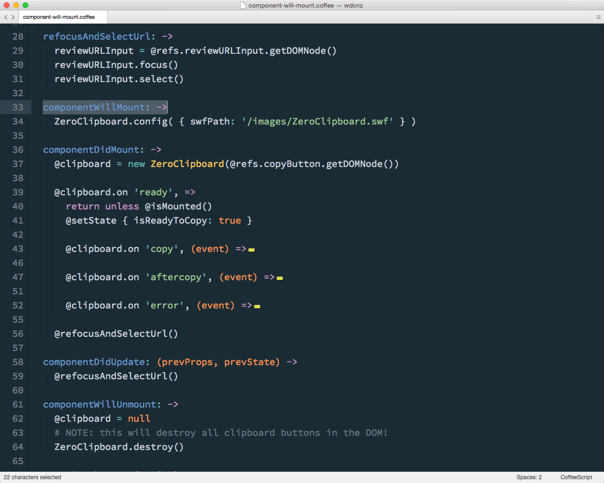
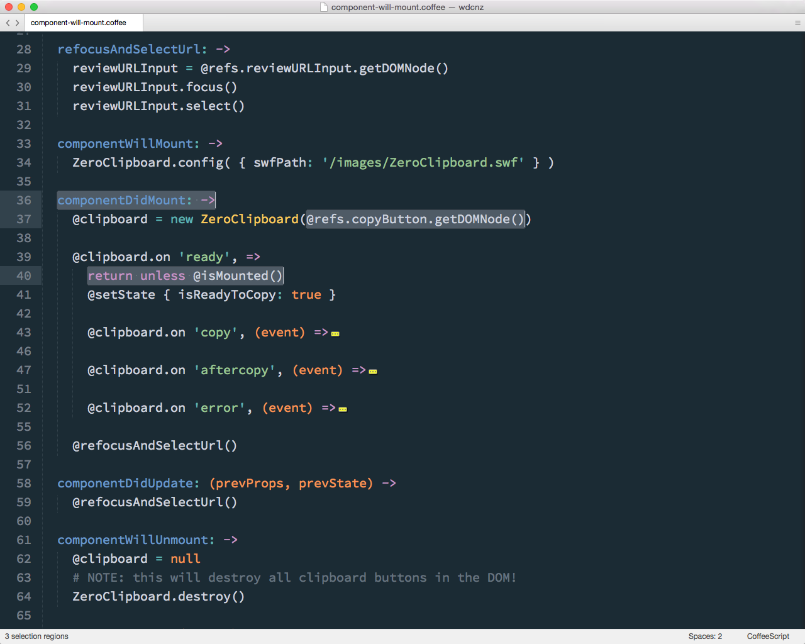
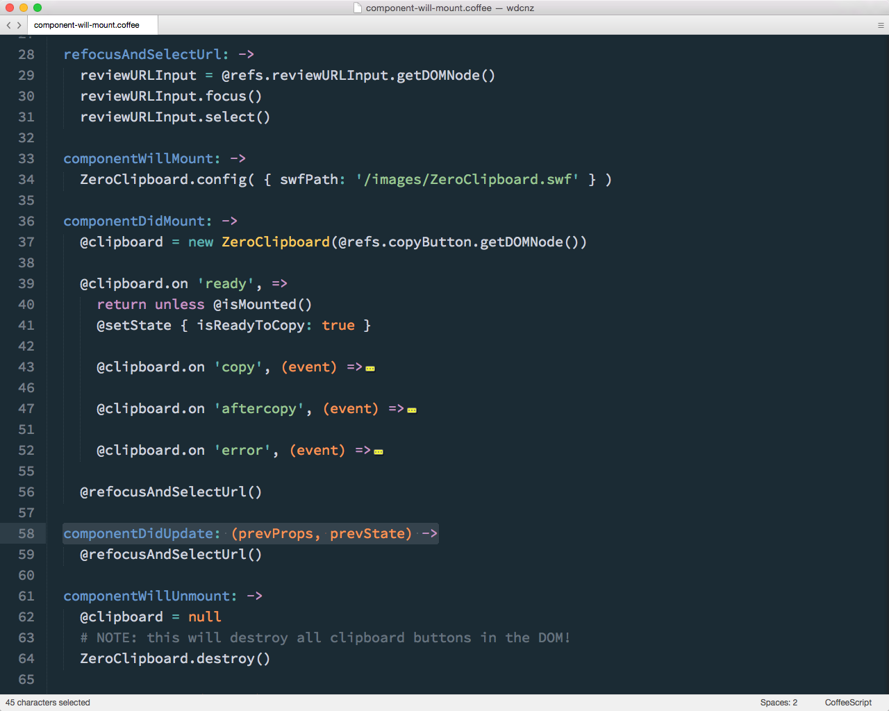
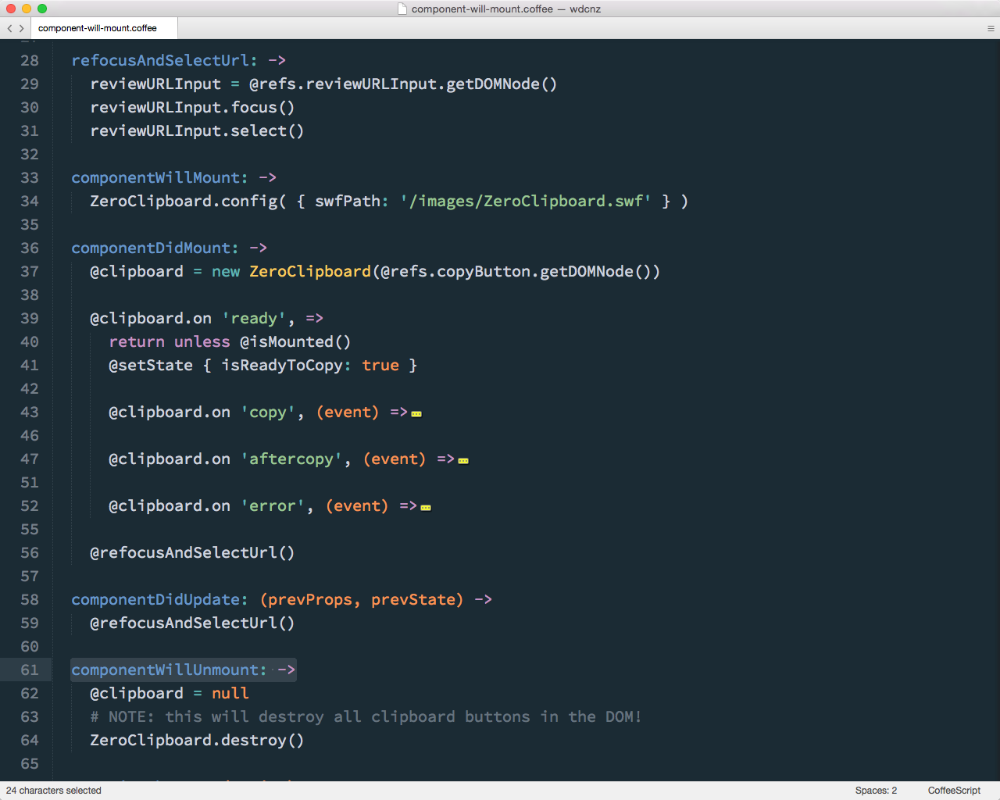

### Component lifecycle

---

Note:
So this is the component lifecycle. 

It's a bit hard to see from this diagram, but the lifecycle is pretty simply, so worth getting your head around properly. There are three distinct phases, mounting, updating and unmounting.

There a few specific lifecycle methods we rely on regularly.

---

### Mounting
- `componentWillMount`
- `componentDidMount`

---

Note:
ComponentWillMount is useful for any kind of setup, such querying initial data or attaching listeners to stores.

You can see here, in a coffee script file that we've yet to port to JavaScript, we're setting up ZeroClipboard ready for use. 

I'm not sure this is the best example, since this only needs to be done once per app, not per mount, so we could probably move this higher up the stack 

---

Note:
ComponentDidMount is when the DOM is accessible, if you need direct access, to the DOM for instance for integration with libraries, or to manipulate focus.

You can see here how we grab the copyButton DOM node via React's getDomNode() method, so that we can attach it ZeroClipboard. This relies on having specified a named reference to the particular DOM node when rendering.

Something to watch out for here is making sure the component is still mounted if you're trying to access from within an asynchronous call. There's no guarantee in a single page app the user won't have navigated away.

---

### Updating
- `componentWillReceiveProps`
- `shouldComponentUpdate`
- `componentWillUpdate`
- `componentDidUpdate`

Note:
componentWillReceiveProps and shouldComponentUpdate, componentWillUpdate and componentDidUpdate are part of the re-render phase, and useful for intercepting and responding to parts of the rendering process.

---

Note:
Here we're using componentDidUpdate to ensure the input box remains selected and focussed, a psuedo state the virtual DOM doesn't manage for us.

shouldComponentUpdate specifically is useful in tuning performance, as we'll see a bit later.

---

### Unmounting
- `componentWillUnmount`

Note:
componentWillReceiveProps and shouldComponentUpdate, componentWillUpdate and componentDidUpdate are part of the re-render phase, and useful for intercepting and responding to parts of the rendering process.

---

Note:
And finally, componentWillUnmount is the place to do any clean up, incuding  cleaning up any listeners created as part of the mount phase.
