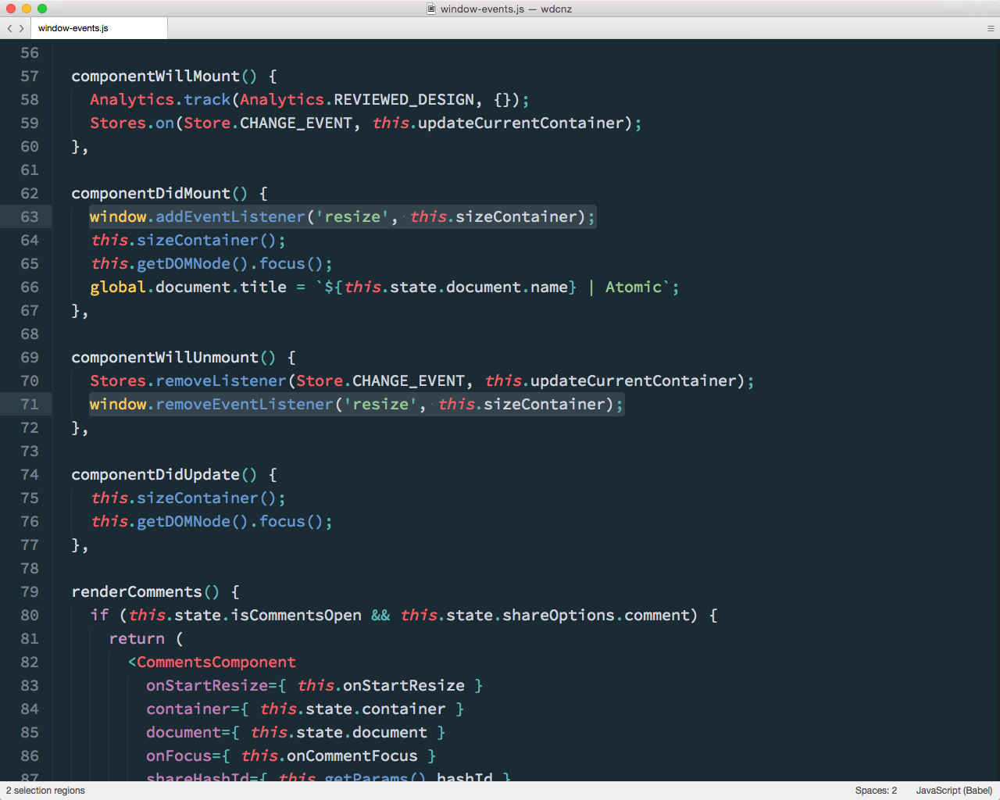

## Synthetic Events
- Cross Platform
- Autobind `this`
- Smart delgation

Note:
React's Synthetic Event system is great. It normalises events across the browser, takes care of binding scope to any handlers you attach back to the component. 

And it's smart about delegation. Whilst you declare event handelers inline, behind the scenes it uses a top level listener and event delegation to keep things performant.

---

Note:

There are times we've had to step outside of React's built in event system and listen to the DOM directly.

For instance we have KeyboardManager that needs to bind to the document, and enable or disable groups of keyboard shortcuts for different parts of the app.

We bind to certain window events such as resize and mouseup directly, as you can see here.

There also a few places where we need finer grained control over image loading events, for example when we're displaying images whilst their being uploaded. For these we bind directly to the image elements load event.

