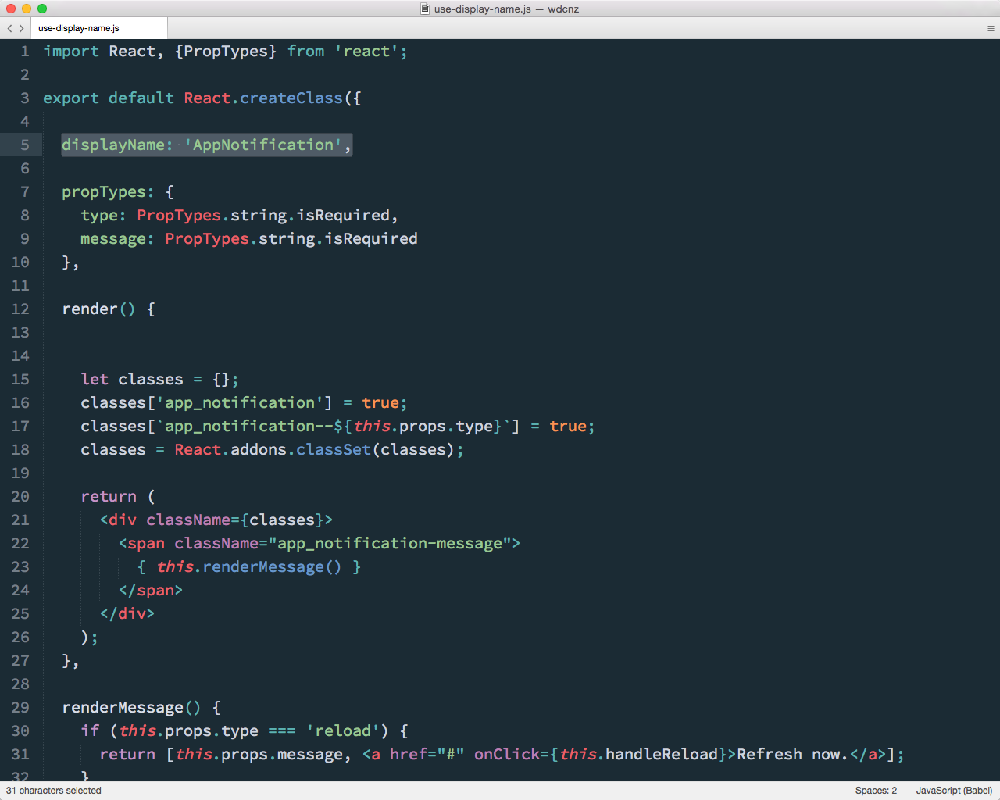

### Basics

Note:
So a few little things we learned as we started authoring components.

---

### JSX
<!-- .element: width="800" -->

Note:
There's definitely a bit of a reaction people have when they first see JSX

Take a breath. It's OK. It's just JavaScript.

It takes a bit of getting used to, but it makes a lot of sense.

The first thing we tried to do was figure out a way to extract the templates back out to a separate files, which is definitely doable, but misses one of the main benefits of a component based approach - a seperation of concerns is NOT the same as a separation of technologies and having the display logic and generation co-located makes for a much nicer development flow.

---

### Use `displayName`
<!-- .element: width="800" -->

Note:
Use displayName, which you get for free when defining components and assigning them to a variable. This is useful for debugging, in the Chrome inspeactor you saw before, and in other performance based tools that I'll show you in a few slides.

---

### Don't Render to `body`
<!-- .element: width="800" -->

Note:
Don't render to body. We did this, and at it resulted in WebFontLoader and React fighting for control over a schizophrenic body tag. I also spoke to Owen recently who spoke about using react to render the entire HTML page in the server. React doesn't really work as an entire templating language.
