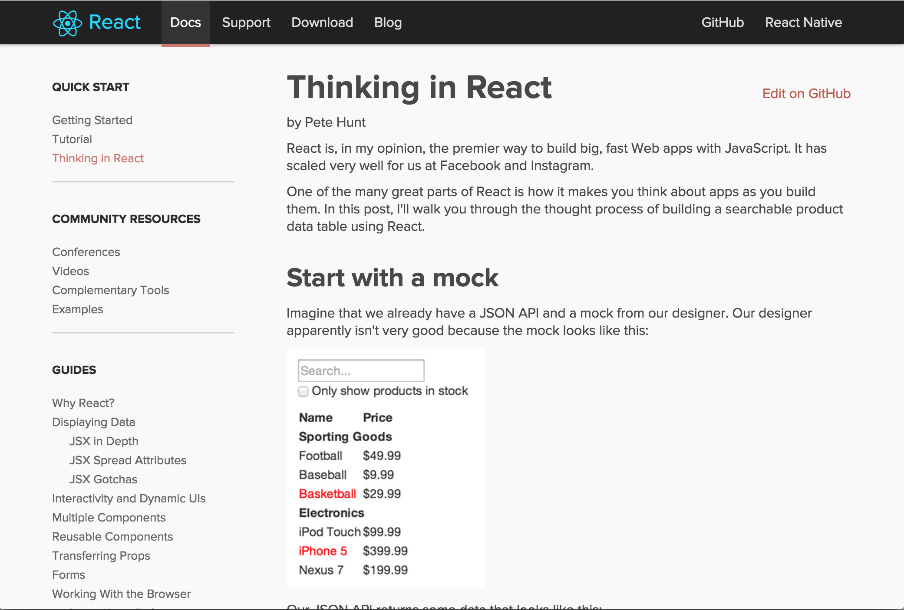
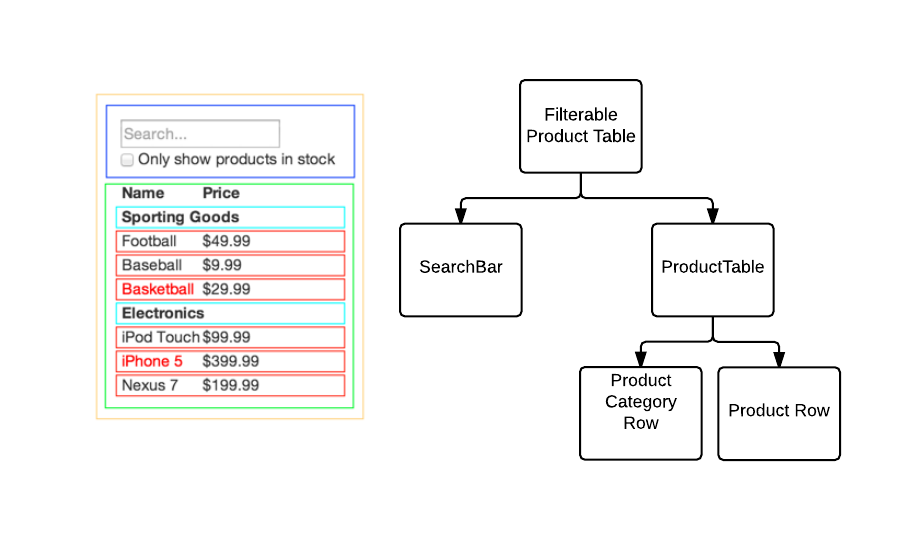

## Thinking in Components
<!-- .element: width="400" -->

Note:
One of the biggest shifts in thinking and benefits of React IMO was starting to think about our entire app as tree of discrete modular components, each with well defined inputs and outputs.with 

---

<!-- .element: width="800" -->

Note:

There's a really great post in the React Docs, which walks you through the process of breaking part of an app up into components, which really made the concept click for me.

---

<!-- .element: width="800" -->

Note:
It takes a small piece of functionality on a web page, and illustrates how you decompose it, and suss out where the data belongs.

One of the great things about React is that it is very much going with the grain of HTML. Thinking of your app as a hierarchy components seems a logical progression to semantic semantic HTML.

The idea of components isn't new, and React isn't the only UI library which allows you to create them. But we've really natural to work with in React, which allows you to take the concept much further.
