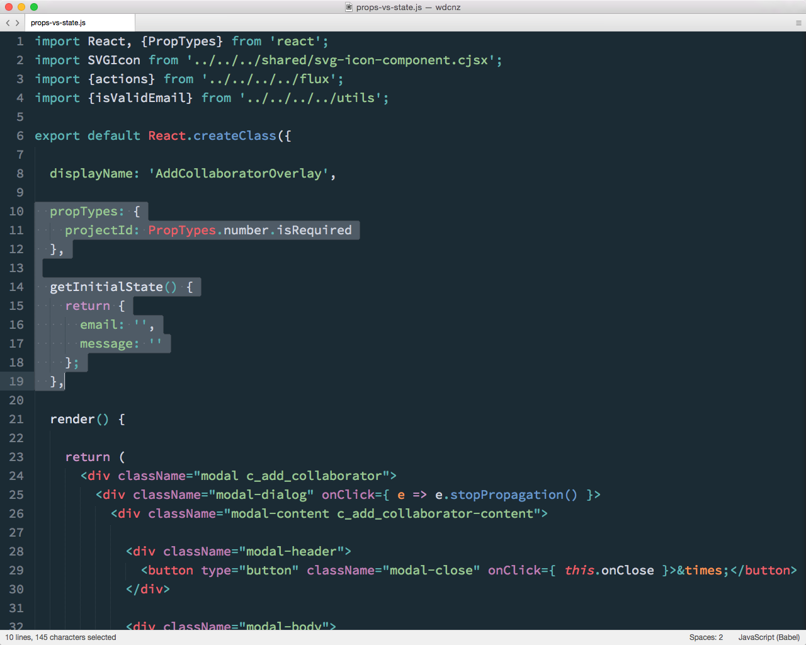

### Props vs State

Note:
A common source of confusion when we got into components was the diference between props and state.

This was something that tripped us up a bit when we first started writing components.

---

Note:
For a given component, it's useful to think of props as the context — passed in and owned by a component and immutable by the component.

If a component needs to persist some local data as part if it's life, we can store this as mutable state in the component. 

Here you can see that the projectId passed into the Add CollaboratorOverlay is a property - it's owned by the parent, and won't be changed by the Collaborator component.

But this component _will_ show a form with email and message, so it needs some state to track the values if these fields.
