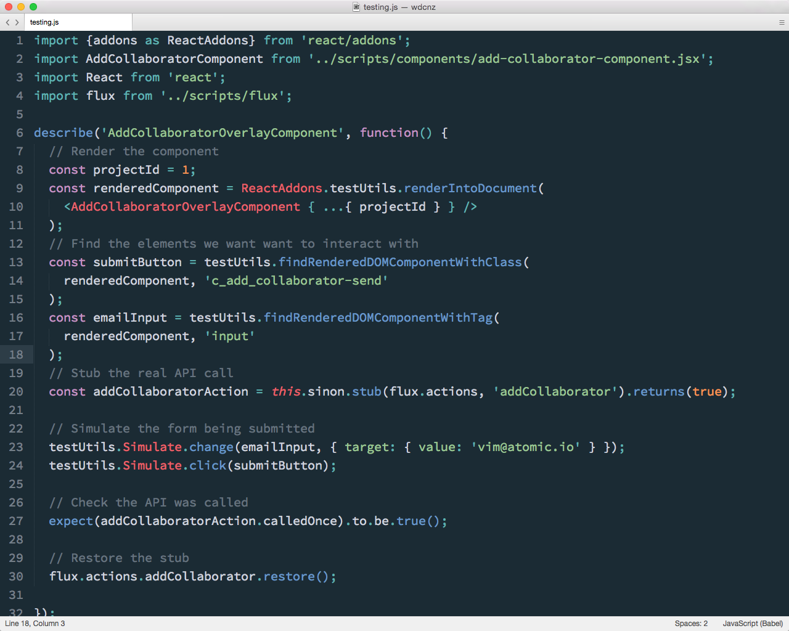
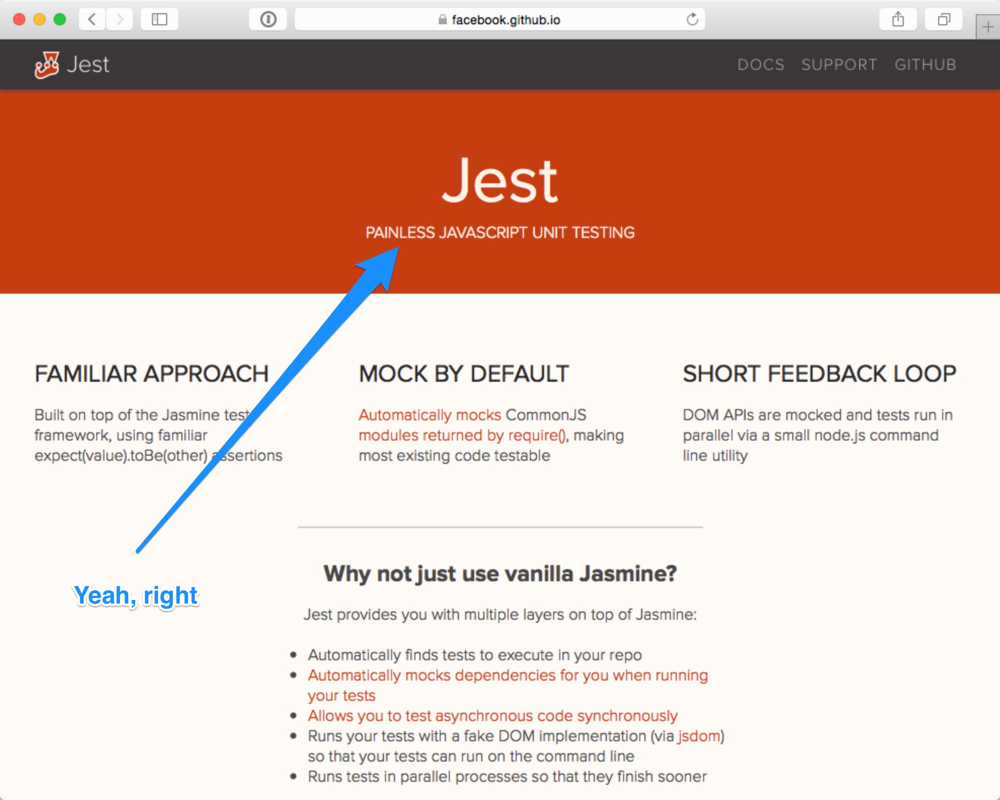

## Testing

Note:
One of the nice things about working with a Virtual DOM and
Synthetic events is that testing is much simpler by default.

Integration testing components in React is nice and easy by default.

---

Note:
React has a TestUtils AddOns which let's you to render components, search for nested components in the rendered results, and simulate Synthetic Events for interations.

This does require a Dom implementation, we use jsdom.

This nice for functional and integration, but we have hit problems with this approach trying, to properly isolate components under tests near the top the hierarchy. 

This generally results in large component graphs rendering, some of which have dependancies that require extensive mocking, which leads excesssive setup.

---

Note:
We tried Jest, a testing library from Facebook which attempts to solve this by monkey patching `require` to automock all common js require modules.

---

This didn't play at all nice with our setup, and was far from painless. I suspect it was to do with the fact that we were using CoffeeScript, but we haven't been back to try again, since it seemsa a little heavy handed anyway.

---

## Shallow rendering

Note:
With the most recent version of React, Facebook added a new experimental feature called Shallow rendering.

This _doesn't_ require a DOM, and allows you to see the results of rendering a component just one level deep and assert against the output without worrying about all the child components.

This looks promising as a way of unit testing testing componets. We're not using it yet, but we're planning in checking it out soon.

