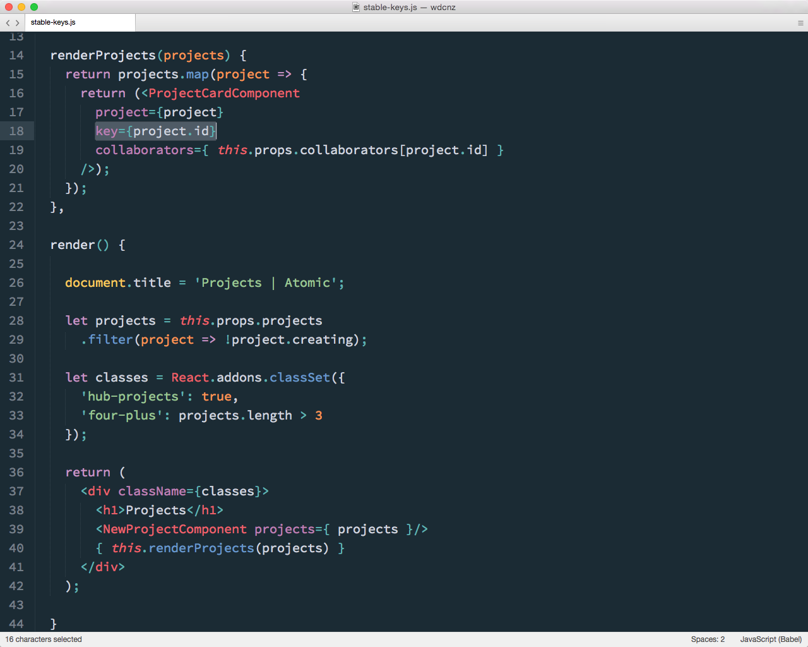
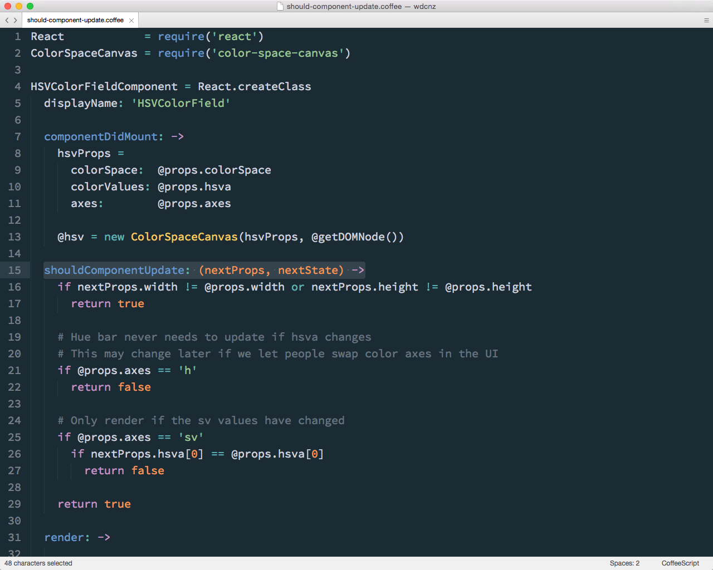
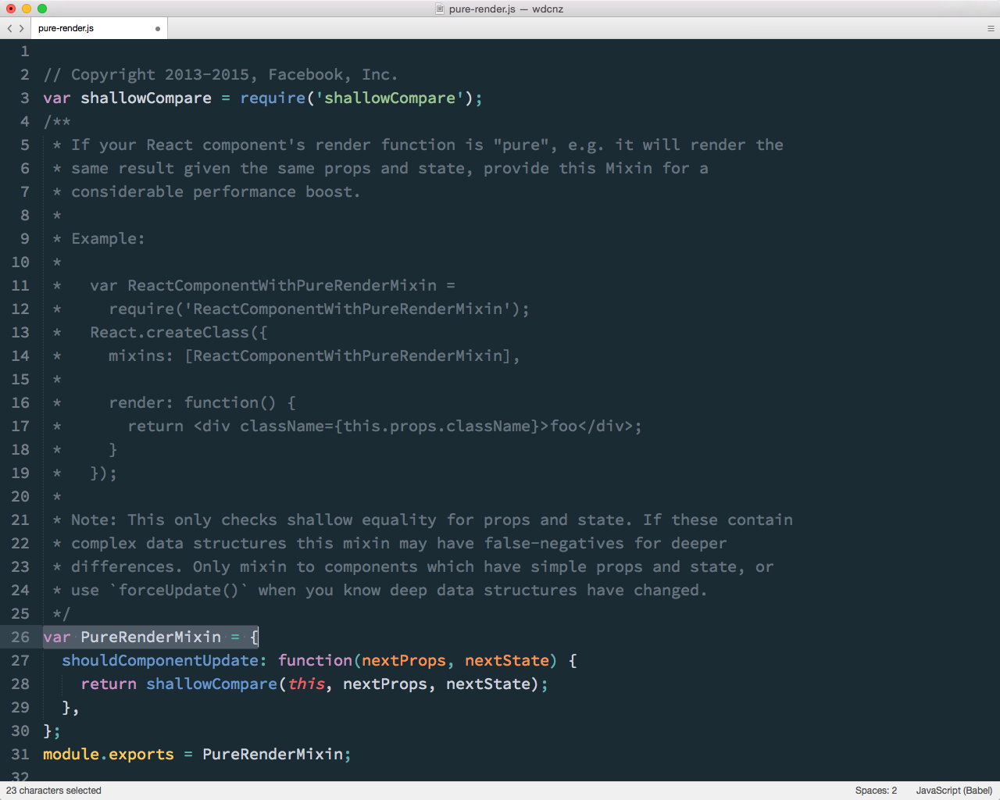

## Performance

Note:
Something that React is often accociated with React is performance.

---

<!-- .element: width="800" -->

Note:
A common misconception that bothers me a bit, is that React is somehow magically faster than all other libraries, because of the virtual DOM.

The way React is architected leads to good perfomance out of the box. 

Applying changes against a virtual DOM, and then deferring to React's reconcilliation alogrithm means that you don't need to do the heavy lifting of figuring out how to update the DOM efficiently. And it generally means you avoid being chatty with the DOM. Effectively "double buffering" changes.

So it's easier to build applications that are fast, but performance will generally be comparable to other frameworks (such as Anguar and Ember) if they are optimised well.

Testament to this is the fact that we haven't got to the stage where we've heavily needed to improve performance in the app, and it's remained at mostly acceptable levels of performance. We've still got quite a bit of work in that are in front of us.

---

## Provide stable keys

---

Note:
A simple performamce tip, which React will actually warn you about in the console is to make sure you're providing _stable_ keys for your components, especially lists of components mapped from arrays.

This helps React when reconciling the DOM.

---

### Avoiding unnecessary rendering

Note:
Whilst React is pretty smart about the way it reconciles it's virtual DOM with the real one, the main performance optimisation technique is to give React hints to reduce the amount of reconciliation it needs to do at all.

---

## `shouldComponentUpdate`

Note:

This is done by using the shouldComponentUpdate hook in the component lifecycle. This is called before the rendering process starts, giving you the opportunity to shortcut the process.

---

Note:
Here you can check if the props or state of a component have changed in a way that effects what will be rendered. If not, return false to shortcut the rendering entirely.

---

## `PureRenderMixin`

Note:
For situations where the rendering result is _just_ dependant on simple shallow props and state values, Facebook provides a mixin which does this check for you.

---

Note:
Source simply does a shallow compare

More complicated with nested data structures

Top level comparison doesn't tell you contents have changed

deepCompare is expensive

Manual change tracking is error prone

---

## Immutable Data

Note:
This is where immutable data structures can help. 

---

Note:
I'll intentionally gloss over the details since it's a fairly dense topic,  essentially these allow you to efficiently change only what is necessary in nested data structures.

So this means shouldComponentUpdate can remain simple even for reference data.

---

## Immutable libraries

Note:
Facebook offers some simple immutable helpers as part of it's addons, and they've also released a more comprehensive library, immutable-js.

We've experimented with both of these in Atomic and we've still got a fair bit of optimisation to do.

Whilst they're great in theory, they can make dealing with data a lot more verbose.

Our current plan is to identify the performance hot-spots within the app, and optimise those with immutable-js if appropriate.

---

## React performance tools
- `Perf.start()` & `Perf.stop()`
- `Perf.printInclusive(measurements)`
- `Perf.printExclusive(measurements)`
- `Perf.printWasted(measurements)`

Note:
React comes with a neat Addon to help you figure out where these performance hotspots are.

It's a pretty simple API that let's you start and stop recording of react operations for analysis, and then print the results.

The most useful call here printWasted, which shows you time spend rendering and reconcillling components that didn't result in any actual DOM updates. I.e. the components that would benefit from implementing shouldComponentUpdate.

---

Note:
This is what the result looked like a few months ago with Atomic. 

It's probably a bit hard to make out, but the printWasted command shows you in the console which components are wasting most time with redundant rendering, and are good candidates for implementing shouldComponentUpdate.
