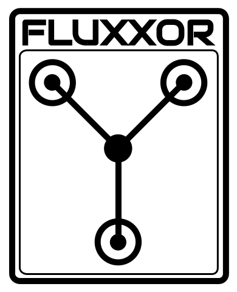
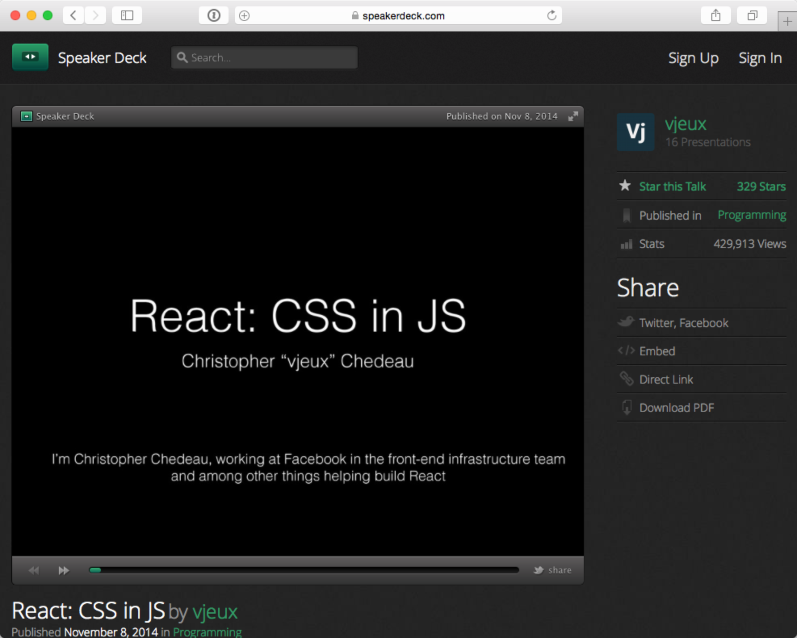
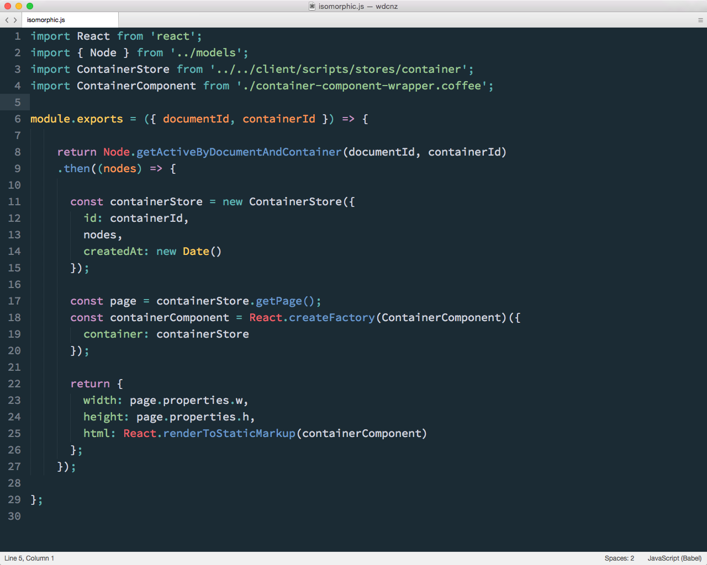
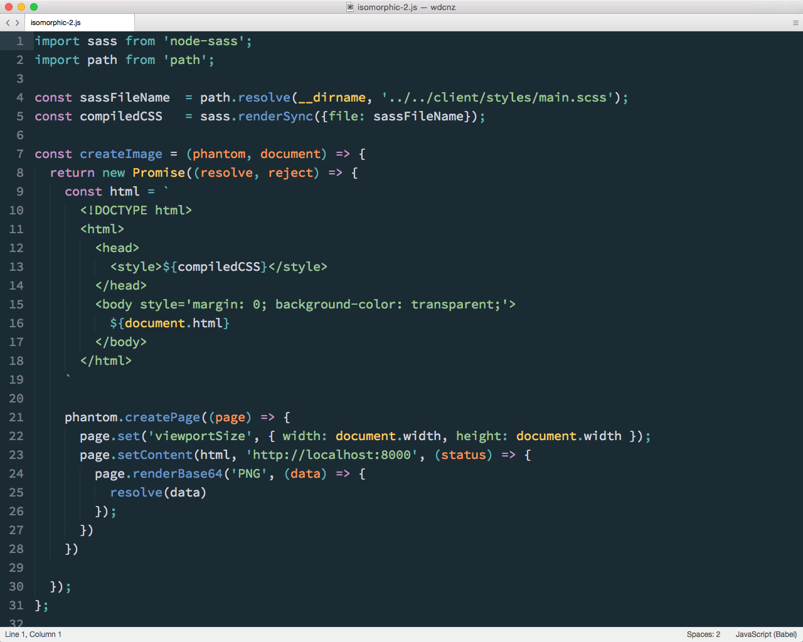
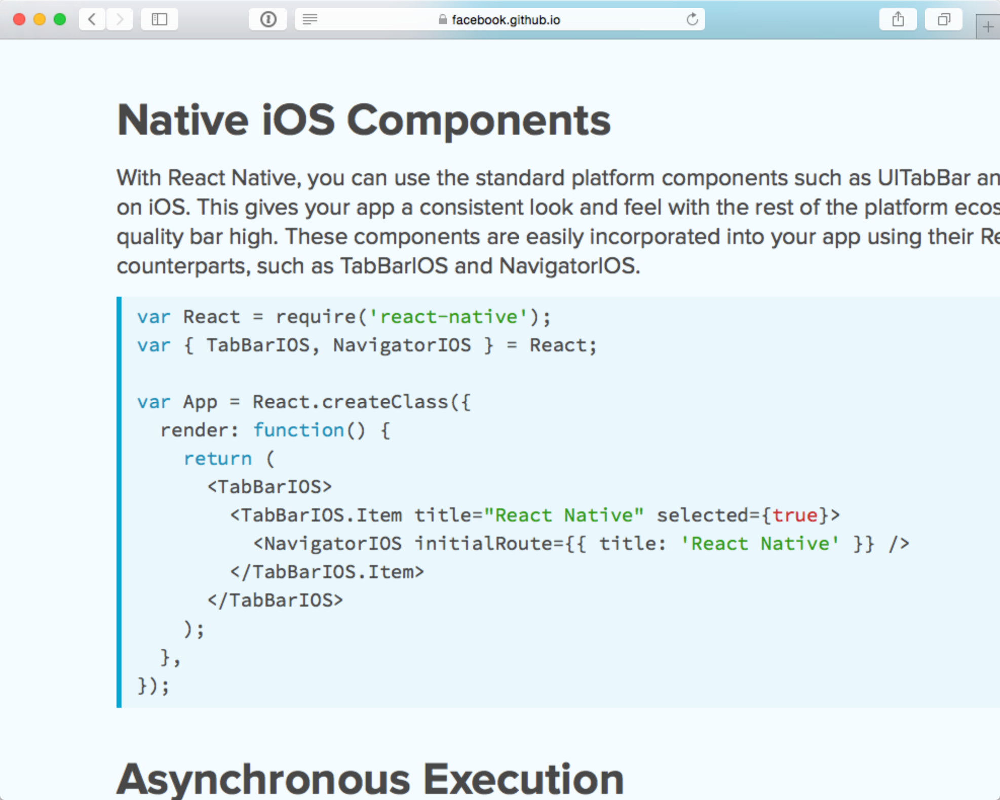

## Everything else

Note:
So, there's a bunch of other things we do and use at Atomic that I could have talked about in more detail. 

I'll whizz through them quickly now, and some of them might be useful to pick up in the Q and A afterwards.

---

## What the Flux?

Note:
- Flux is a pattern that Facebook reccommends to enforce one way data flow, which compliments React.
- Makes it simpler to manage the messaging flow in your application as it grows.
- Not many libraries early, so we rolled our own initially

---

Note:
- We currently use a library called Fluxxor
- Stays true to the original intent of the pattern, with some conveniances
- Area of intense deveopment, Relay and GraphQL
- We'll probably change

---

## Routing

---

Note:
There's actually not that much to say here, apart from use react-router. We do, and it's been great. In part, because they stole some great ideas and approaches from the Ember community, who have done some great work in producing a solid router abstraction.

---

## CSS in JS

Note:
Whilst we use SASS for the UI at Atomic, the styles that make up designs that our users create are stored as JSON, and rendered inline to React Elements.

Now we do this so we can store these styles in a structured format, and allow them to be edited from within the app.

But the idea of declaring styles as JSON is an idea that's picking up some traction in the react community, which we're definitely keeping an eye on.

---

Note:
Christopher Chadeu who is in the React team gave a talk a few months back on the problems of scoping CSS at scale, and how some of these might be tackled by bringing CSS into JavaScript.

This has lead to quite a bit of activity in the community with a few libraries popping up proposing new ways to pull CSS into javascript.

- Interesting in wider context that just React
- Ask the THE FUTURE OF CSS panel 

---

### Isomorphic JavaScript
- a.k.a. Universal JavaScript
- a.k.a. Rendering on in the server

Note:
So another benefit of the virtual DOM is being able to render on the server.

The general use for this is to be able to generate the HTML that represents the state of your application on the server, send it down to the client, and then have the client JavaScript take over.

---

Note:
We have a slightly different use case where we need to generate an image of a users design on the server.

We do this be re-using our client side Stores and Components on the server to generate the HTML we need using a method called `renderToStaticMarkup`.

---

Note:
And then we embed this HTML in full page, and send this off to PhantomJS to grab a screenshot.

---

### React Native

Note:
And finally, React Native, which again could make a talk in it's own right.

For those that don't know, React Native is A FRAMEWORK FOR BUILDING NATIVE APPS USING REACT.

---

### "_Learn Once Write Anywhere_ "

Note:
It let's you you React's component based API to declare native UIs, which are simply wrappers around the native components themselves.

There have been a number of different efforts to use web technologies to build native UIs, with varying degrees of success, so it will be interesting to see where this goes.

We're currently evaluating it as a way to let people design native UIs in the browser.

